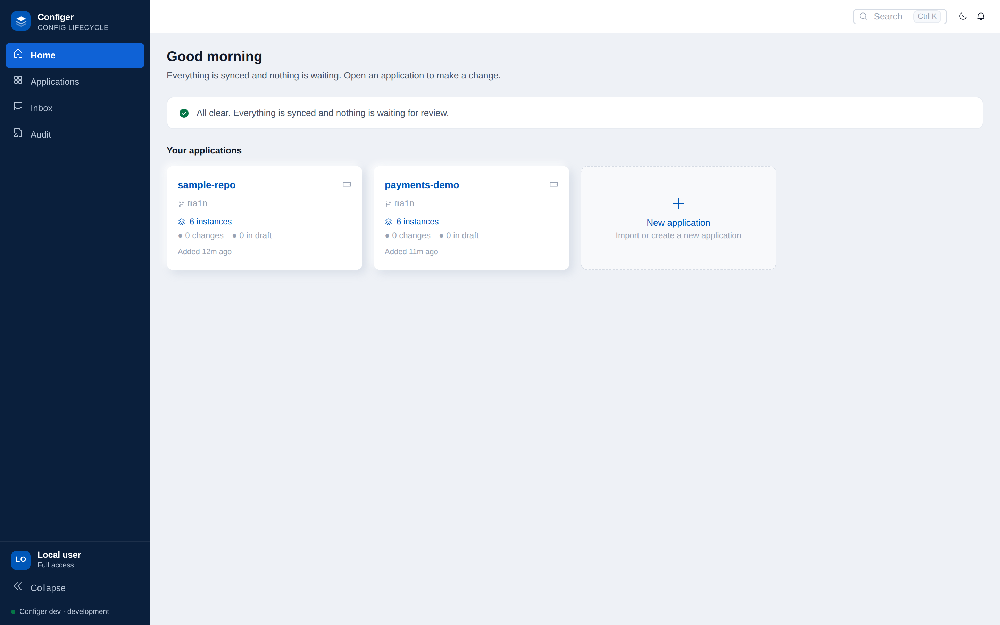
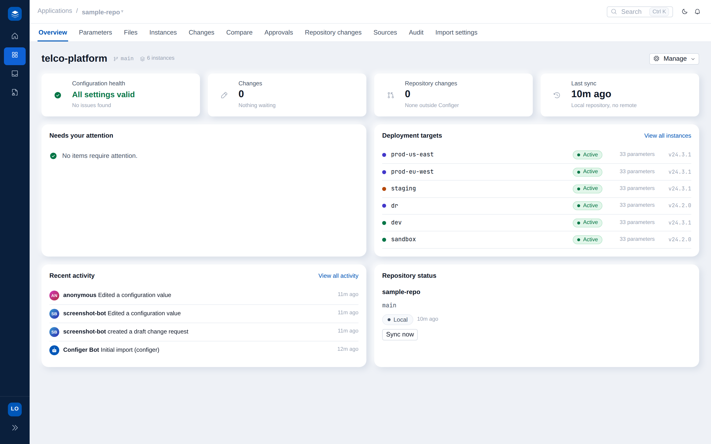
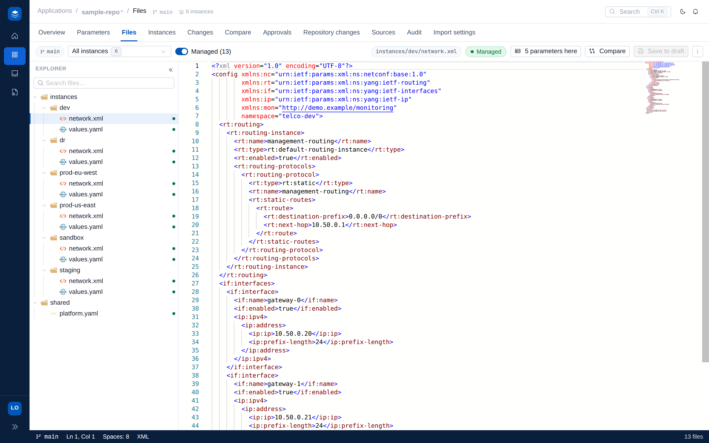
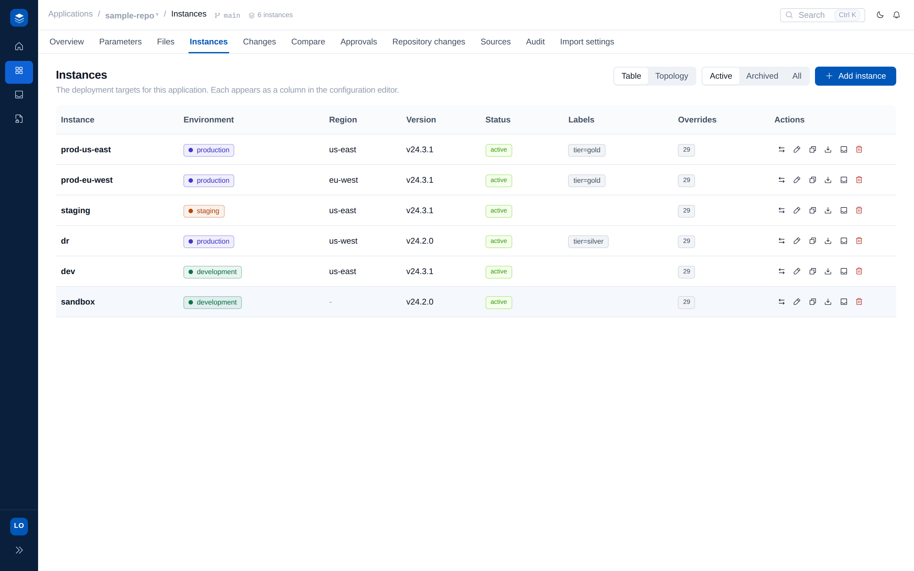
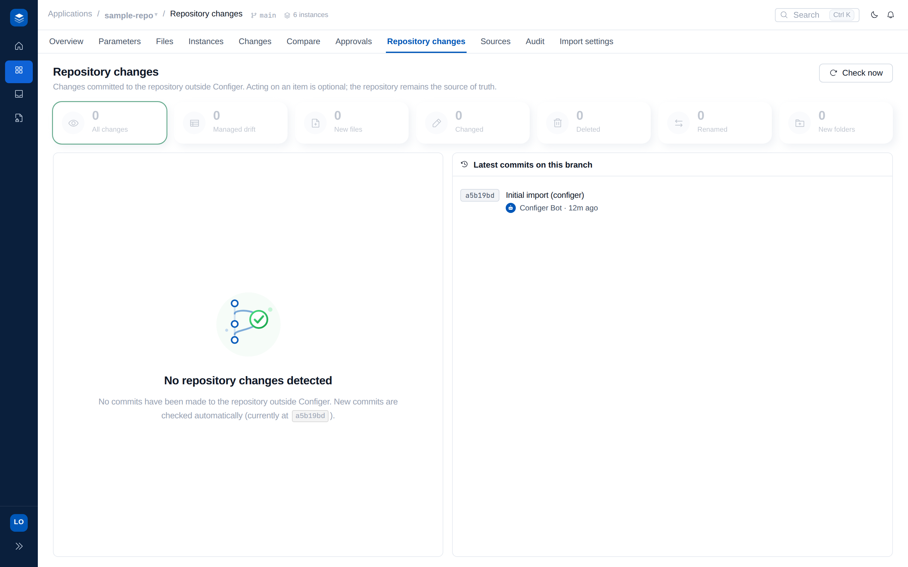
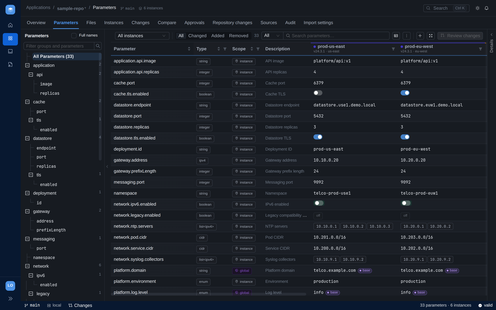

# Configer - feature tour

The full walkthrough of what Configer does, with screenshots of the real UI.
For the short version, start with the [README](README.md).

Screenshots are regenerated from the live app with
[`scripts/capture-media.mjs`](scripts/capture-media.mjs); see
[docs/screenshots/](docs/screenshots/).

---

## The portfolio

Every managed application at a glance - instance counts, pending changes, and a
"needs attention" rail - so you land where work is waiting.

## One application, as tabs

Opening an application gives you everything about it behind a row of tabs:
Overview, Parameters, Files, Instances, Changes, Compare, Approvals, Repository
changes, Sources.

The **Overview** shows health signals (all settings valid / issues found),
pending changes, drift from Git, last sync, and the deployment targets.

## The grid

The heart of the product: a virtualized parameter x instance matrix. Rows are
parameters (grouped into a tree on the left), columns are instances, cells are
the resolved values.

- **Typed cell editors** - numbers clamp to min/max, enums are dropdowns,
  booleans toggle, lists edit as chips, IP/CIDR/quantity fields validate live.
- **Provenance badges** on every cell - own file / shared base file / declared
  default - with the exact file and path in the details panel.
- **Scope badges** - `instance` (bound in the instance's folder) vs `global`
  (bound in a shared file; one edit changes everyone).
- **Version-aware cells** - `new` / `deprecated` / `n/a` driven by each
  instance's software version.
- **Deduplicated rows** - a setting repeated across files is one row; editing it
  fans the write out to every bound location.

## Validation, enforced

Rules are derived automatically - from JSON Schema files next to the config
(`values.schema.json`, `<file>.schema.json`, `.configer/schemas/`), from a
preset library (ipv4, ipv6, cidr, port, fqdn, url, email, uuid, semver, cpu,
memory, percentage, ...), and from the values themselves. Bad input is caught in
the cell, and the backend re-validates every write and rejects it with `422` -
so Git never holds an invalid value.

**Kubernetes quantities are first-class.** `cpu` (cores/millicores) and `memory`
(binary/decimal SI bytes) validate both their format and that the amount is
positive. Discovery also wires the classic pairing automatically: a resource
**limit must be at least its request**, and a request at most its limit -
compared by real magnitude, so `1` core is correctly greater than `500m` and
`1Gi` greater than `512Mi`.

## Compare

A semantic, parameter-level diff between any two instances - at the working tree
or across git refs (branches, tags, commits). "staging today vs prod at v24.2"
is one dropdown away.

## File mode

A VS Code-style Monaco editor over the instance's real files: a file tree with
modified markers, a live side-by-side diff of committed vs draft-applied
content, and full editing. Saving stages into the SAME draft as grid edits -
changes to managed values become validated cell edits (the grid updates
instantly), anything else stages as a file edit. Grid and files are two views of
one draft.

## Instances

The deployment targets, with environment, region, version, and status. Creating
an instance stages a structural change: on submit the branch carries a
scaffolded folder following the repository's own convention (a Kustomize overlay
copy with self-references renamed, a kpt package copy with its Kptfile renamed, a
plain folder copy) plus the registry entry. Retiring works the same way, in
reverse.

## Change requests

Drafts accumulate edits (cells, file edits, instance changes) shown in a Source
Control panel grouped by file with one-click undo. Submitting cuts a branch
`configer/cr-<n>`, makes one attributed commit, and opens a GitHub PR when
configured. The state machine (`Draft -> Under Review -> Approved -> Published /
Rejected`) reflects PR activity both ways.

## Repository changes (drift)

A background sync keeps the working tree fast-forwarded; commits made directly in
Git appear in the grid automatically, and the Repository changes inbox surfaces
new / changed / deleted config files with one-click import or retire.

## Dark mode

The whole product is themeable, light and dark.

## Multi-user platform (optional)

Configure a GitHub OAuth app and Configer becomes a shared deployment: sign-in,
per-application roles (viewer / editor / **approver** - publishing is
approver-gated), member management for admins, an audit trail of every action,
and commits attributed to the real person. Platform data lives in an embedded
SQLite file by default (zero external services); set `DATABASE_URL` for
PostgreSQL in production. Without OAuth configured, none of this surfaces - the
single-user self-hosted experience stays untouched.

---

## API

The REST API mirrors the UI. A few of the routes:

| Method | Path | Purpose |
|--------|------|---------|
| POST | `/api/discover` | Read-only onboarding proposal: layout, instances, deduplicated parameters. |
| POST | `/api/init` | Initialize: one commit writing `.configer/`. |
| GET | `/api/grid` | The parameter x instance matrix with provenance + validation. |
| PUT | `/api/values` | Validated cell edit staged into the draft (422 on invalid). |
| PUT | `/api/files/draft` | File-mode save: managed values become cell edits, else a file edit. |
| GET | `/api/render/{instance}` | The instance's real files with the draft applied in memory. |
| POST/PUT/DELETE | `/api/instances...` | Instance lifecycle (create/retire stage structural changes). |
| GET/POST | `/api/changes...` | Change requests: list, draft, submit, merge (approver-gated), reject. |
| GET | `/api/compare` | Parameter-level diff, instance to instance, optionally at git refs. |
| GET | `/api/repo/findings` | External-commit inbox (drift detection). |

Full spec at `/api/openapi.yaml` and `/api/openapi.json`, interactive UI at
`/api/docs`. The spec is generated from the handler annotations (`make docs`) and
CI fails if it drifts, so it always matches the code. Every repo-scoped route
also mounts under `/api/repos/{id}/...` for multi-application workspaces.
