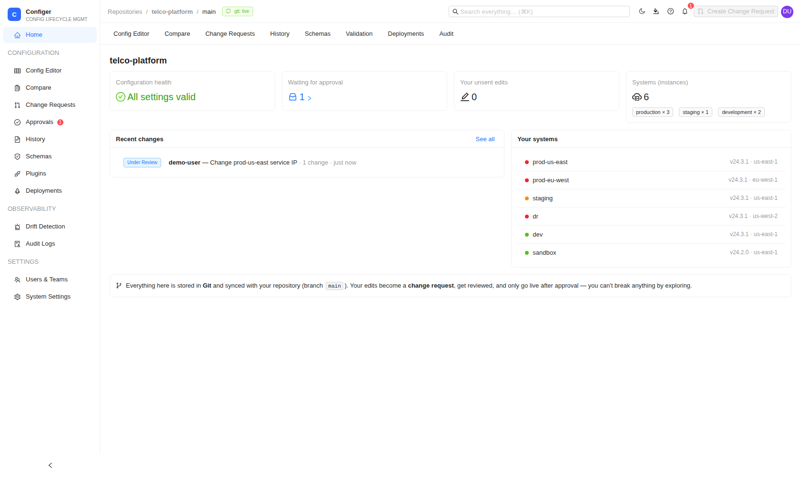
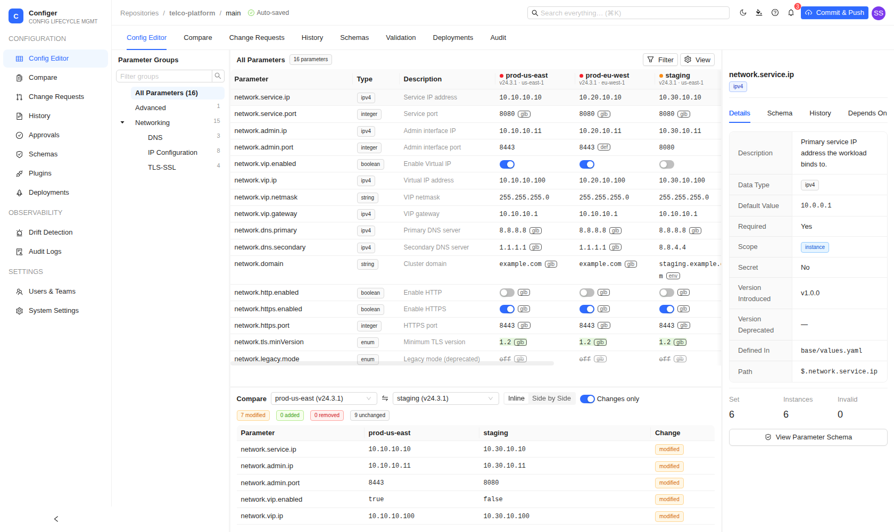
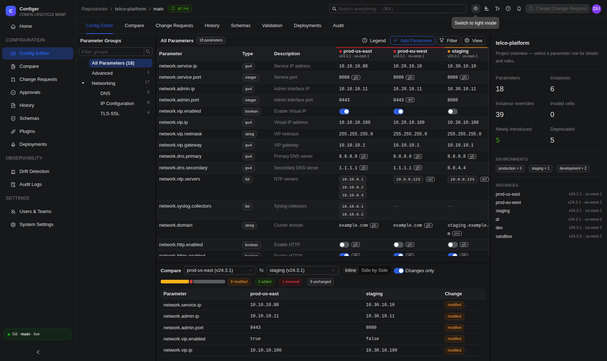
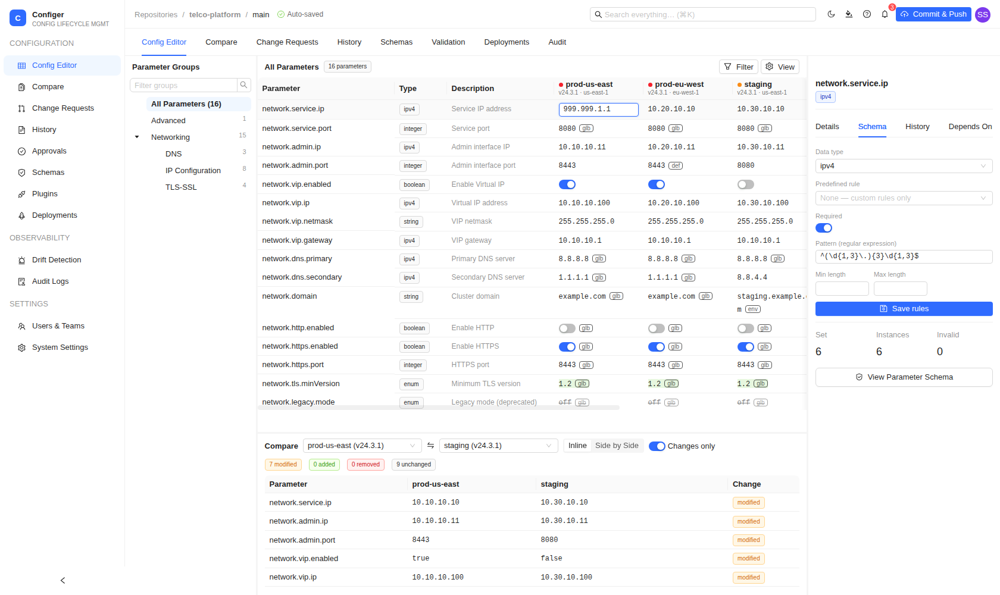

# Configer

Enterprise-grade configuration management platform that abstracts heterogeneous
configuration formats (YAML, JSON, XML, Helm values, Flux, kpt/KRM, …) into a
single structured parameter model, while **Git remains the source of truth**.

Configer scans a Git repository and presents a **spreadsheet view**: every
**row is a parameter**, every **column is an instance** (region / environment /
zone / site). Teams enrich parameters with metadata, set per-instance values,
bulk-edit, compare, and validate, and every change flows back to Git as
commits on branches, reviewed via pull requests, and published by merging.






## Why

At scale you have hundreds of config files, tens of thousands of parameters,
replicated across many instances that may run different software versions.
Editing them by hand is error-prone and impossible to reason about in bulk.
Configer is the abstraction layer; Git stays native and canonical.

## What's in this repository

| Path | Description |
|------|-------------|
| `backend/` | Go API: parses the repo, resolves scope precedence, builds the grid, computes diffs, renders generated artifacts, and exposes everything over REST. |
| `frontend/` | React + Vite + TypeScript + **Ant Design** SPA: nav rail, category tree, virtualized parameter×instance grid, details panel, compare view, plugins view, light/dark/brand theming. |
| `sample-repo/` | A self-contained managed repository fixture (the `telco-platform` project) that the backend serves out of the box. |
| `deploy/` | `docker-compose.yml` for the self-hosted stack (backend + frontend + Postgres). |
| `.github/workflows/` | CI: Go vet/test/build + frontend typecheck/build. |

### How the abstraction maps to Git

```
sample-repo/
  base/                       # original/base config files (structure = truth)
  .configer/
    catalog.yaml              # the parameter model (id, name, path, type, validation, lifecycle)
    instances.yaml            # central instance registry (version / region / zone / env)
    scopes.yaml               # global / environment / site / zone overlays
    ignore.yaml               # selective-import rules (skip files / parameters)
    instances/<name>/overlay.yaml   # sparse per-instance value overrides
  generated/                  # rendered, ready-to-consume artifacts (git-native output)
```

**Scope precedence** (later wins): `default → global → environment → site → zone
→ instance`. Each grid cell shows the effective value plus a badge indicating
which scope supplied it.

**Version-aware cells:** a parameter carries `versionIntroduced` /
`versionDeprecated`; an instance carries `softwareVersion`. Cells render as
**new**, **deprecated** (disabled), or **not-applicable** accordingly.

### Typed editing & validation enforcement

Every parameter declares a **data type** (`string`, `integer`, `number`,
`boolean`, `enum`, `ipv4`, `cidr`) and **validation rules**: required, regex
pattern, min/max, character limits (`minLength`/`maxLength`), allowed values,
or a **predefined rule** from the built-in library (`ipv4`, `cidr`, `port`,
`hostname`, `fqdn`, `url`, `email`, `uuid`, `semver`, `duration`).

- The grid renders a **type-appropriate editor** per cell: a toggle for
  booleans, a number input that **clamps to min/max** for integers, a dropdown
for enums, and a text input with live regex/length feedback for strings;
  invalid entries cannot be committed.
- The **rule editor** (details panel → Schema tab) lets users pick a
  predefined rule from a dropdown or define custom rules; saved rules land in
  `catalog.yaml` and take effect immediately.
- The backend **re-validates every write** (type coercion + preset + explicit
  rules) and rejects invalid values with `422`, so Git never holds bad data.

### Structural divergence: lists, absence, and per-instance cardinality

Instances differ in *shape*, not just values: lab may carry 1 NTP server while
production carries 10. Verified renderer semantics (see
`backend/internal/render/render_test.go`):

| Scenario | YAML / JSON (incl. Helm values, Flux, kpt, which are YAML at rest) | XML |
|---|---|---|
| **List parameter** (`type: list`, `itemType: ipv4`, …) | native sequence: one line per entry, length per instance | repeated sibling elements: one `<server>…</server>` per entry |
| **Value unset / instance excluded** | key omitted entirely; empty parent maps pruned, **no line remains** | attribute/element removed; empty parent elements pruned, no husk like `<syslog/>` |
| **Unmanaged content in the base file** | passes through untouched | passes through untouched (incl. comments) |
| **User adds a parameter** (GUI → catalog) | appears only in instances where a value resolves | element/attr created on demand per instance |
| **User retires a parameter** (GUI) | removed from catalog + every overlay; regenerated files drop it everywhere | same |

Cell-level actions (right-click): **Edit value**, **Reset to inherited**
(remove the override, fall back to zone/site/env/global/default), **Exclude
from this instance** (render nothing, even if a default exists), and **Copy
value to…** other instances. All actions stage into the draft change request,
reviewable before anything touches Git.

### Git-native change requests

Cell edits never touch Git directly; they stage into a **draft change
request** (dashed-orange pending cells, auto-saved). Submitting the draft:

1. cuts branch `configer/cr-<n>` from the target in an **isolated worktree**,
2. writes the sparse overlays and re-renders `generated/` for the touched
   instances,
3. commits with the machine identity plus a `Changed-by: <user>` trailer,
4. pushes and, when the origin is GitHub and `GITHUB_TOKEN` is set, **opens a
   real pull request**,
5. tracks state: `Draft → Under Review → Approved → Published / Rejected`.

**Approve & Merge** in the UI performs the real merge (GitHub PR merge API, or
a `--no-ff` git merge in pure-git mode) and pushes the target branch. PRs
merged or closed directly on GitHub are detected and reflected back.

### Always live, never a blocker

A background sync loop (`CONFIGER_SYNC_SECONDS`, default 30) fetches origin and
fast-forwards the working tree, so **commits made directly on Git appear in the
grid automatically**: the header shows `git: live`. Everything Configer writes
is ordinary Git (branches, commits, PRs), so anything it does can also be done
directly on GitHub; if Configer is down, nothing is blocked.

### UI

- **Dashboard command center**: system health tile map, settings-by-category
  donut, 14-day change-activity sparkline, accent stat cards, recent activity
  in human sentences, and a Git education footer.
- **Virtualized** parameter×instance grid that auto-fits columns to the
available width: smooth with tens of thousands of rows; zebra rows,
  environment-tinted column headers, and a **group-overview strip** that fills
  leftover space when rows end early (no dead screen area).
- **Four responsive tiers**: phone (<576px: bottom tabs + read-only parameter
  cards with search), tablet (drawer-based panels), laptop (three-panel), and
  big monitors (proportional scaling).
- **Resizable panels** (tree / grid / compare / details) with persisted sizes;
  **View** menu for density, column visibility, and panel toggles; a
  **comfort text-size toggle** for easier reading.
- **Global search (⌘K)** matches names, descriptions, categories, source
  files/paths, and **values** across every instance.
- Light / dark / **company-brand theming** via design-token overrides; charts
  use a CVD-validated palette with legends (never color alone).

### Resilience, deployment identity, and offline editing

- `GET /api/meta` reports the deployment's name, version (`CONFIGER_VERSION`),
  and environment (`CONFIGER_ENV`), so in-app messaging names the actual
  deployment instead of pointing at `localhost` or dev-only instructions.
  Shown as a chip in the nav rail.
- The frontend keeps a **local snapshot** of the grid, changes, and meta
  (`localStorage`, see `frontend/src/offline.ts`). If the backend is
  temporarily unreachable, the UI keeps rendering the last snapshot instead of
  a blank error page, with a calm banner explaining what's happening.
- Cell edits made while offline are **queued on the device** and replay
  automatically once the connection returns; nothing is lost.
- Every view has a **state-aware skeleton** (`components/Skeletons.tsx`) that
  mirrors its real layout instead of a generic spinner.
- Icons are bundled **Phosphor** glyphs via Iconify (`components/icons.tsx`,
  `@iconify-icons/ph`), imported as per-icon data so the app never fetches
  icons at runtime (works fully offline/air-gapped).

### Import wizard

The **Import** section turns repository files into managed parameters in
three steps. A read-only scan (`POST /api/scan`) lists every detected config
file with counts of new vs already-managed settings; unticked files can be
remembered as ignore rules. The selection step offers inline and bulk editing
of type, category, scope and secret, with categories suggested from the
setting name and credential-looking names pre-marked secret (values masked).
The review step summarizes and explains, in plain words, the single Git
commit that `POST /api/import` will make. Lists that parsers flatten into
indexed entries (`servers[0]`, `servers[1]`, ...) are folded back into one
list parameter, and a list that is already managed never gets re-offered
element by element.

### Repository Changes inbox

Anything committed directly on Git, outside Configer, surfaces in the
**Repository Changes** section (live count badge in the nav rail). `GET
/api/repo/findings` compares the last-acknowledged commit with `HEAD`: new
config-shaped files (with a candidate count), managed files edited, deleted
or renamed, folders where several files appeared at once (a likely vendor
version drop), plus a safety net that flags any managed source file missing
from disk even when it was added and deleted within one unacknowledged
window. Each finding is a card with a plain-word explanation and a one-click
action: import the new file's parameters (jumps into the wizard focused on
that file), retire parameters whose source file was deleted (`POST
/api/parameters/retire-file`), or open affected parameters in the editor.
Findings resolve themselves once handled; `POST /api/repo/findings/ack`
marks everything as seen.

### Plugin architecture (everything is extensible)

The core is a plugin registry (`backend/internal/plugin`):

- **Ingest parsers**: YAML / JSON / XML (built-in), pluggable for more formats.
- **Transposers**: turn resolved config into arbitrary output artifacts. The
  built-in **Flux HelmRelease generator** synthesizes manifests that do *not*
  exist in the source repo. Add your own to emit any target shape into
  `generated/`.
- **Schema importers / validators / AI providers**: interfaces defined for
  JSON-Schema/YANG import, custom validation, and a plug-and-play AI module
  (intent → change request, chat across configs).

See [`docs/PLAN.md`](docs/PLAN.md) for the full design (RBAC & SSO, Git identity
modes with commit attribution, merge-conflict handling, Postgres grid cache,
drift detection, and the delivery phases).

## Run it locally

**One command** (backend `:8080` + frontend `:5173` together, Ctrl-C stops both):

```bash
make install   # first time: go modules + npm
make dev       # or: task dev
```

`make help` lists every target (build, test, lint, docker, …). Configuration is
documented in [`.env.example`](.env.example); backend/platform notes and the
technology roadmap are in [`docs/BACKEND_TECH.md`](docs/BACKEND_TECH.md).

Interactive **API docs** (offline Swagger UI) are served at
`http://localhost:8080/api/docs`, and the raw OpenAPI spec at `/api/openapi.yaml`.

Prefer to run the pieces by hand, or via Docker:

```bash
# Backend (serves the sample repo)
cd backend && go test ./... && CONFIGER_REPO=../sample-repo go run ./cmd/configer

# Frontend (proxies /api → :8080)
cd frontend && npm install && npm run dev

# Everything via Docker (frontend :8088, backend :8080)
cd deploy && docker compose up --build
```

## API (MVP)

| Method | Path | Purpose |
|--------|------|---------|
| GET | `/api/grid` | Full parameter×instance matrix with cell states + validation. |
| GET | `/api/project` | Project name, instances, category tree, counts. |
| GET | `/api/parameters/{id}` | Parameter metadata. |
| GET | `/api/compare?left=&right=` | Semantic parameter-level diff between two instances. |
| GET | `/api/render/{instance}` | Rendered `generated/` artifacts (values + transposer output). |
| POST | `/api/scan` | Ingest scan: detect files, extract candidate parameters. |
| GET | `/api/plugins` | Registered plugin manifests. |
| GET | `/api/validation/presets` | The predefined validation rule library. |
| PUT | `/api/values` | Validated edit staged into the draft change request (422 on invalid). |
| DELETE | `/api/values?paramId=&instance=` | Revert one pending draft edit. |
| PUT | `/api/parameters/{id}` | Update a parameter's data type/validation rules (committed directly with attribution). |
| GET | `/api/changes` · `/api/changes/draft` · `/api/changes/{id}` | Change request list / current draft / detail (syncs PR state). |
| POST | `/api/changes/{id}/submit` | Draft → branch + commit + push + PR → Under Review. |
| POST | `/api/changes/{id}/merge` | Approve & merge (GitHub PR merge or local git merge) → Published. |
| POST | `/api/changes/{id}/reject` | Reject/close (draft: discard). |
| GET | `/api/repo/status` · POST `/api/repo/sync` | Git-liveness status / force a sync now. |
| GET | `/api/meta` | Deployment name, version, environment. |
| GET | `/api/repo/findings` · POST `/api/repo/findings/ack` | Reconcile: what changed on Git since last look; mark it seen. |
| POST | `/api/import` | Promote scanned candidates into the catalog (the import wizard's final step). |
| POST | `/api/parameters/retire-file` | Retire every parameter sourced from one file. |

## Status

**Live end to end today:** ingest to catalog to scope resolution to an
**editable grid** with typed, validation-enforced editors (incl. list
parameters and absence/exclusion) to a **draft to change request to branch to
commit to PR to publish** pipeline that is git-native both ways (external
commits sync in automatically; PRs approved on GitHub reflect back). Also
live: the **import wizard** (scan, choose and enrich, initialize), the
**Repository Changes inbox** (external Git activity with one-click
import/retire resolutions), the dashboard command center, approvals inbox,
compare view, the plugin architecture (YAML/JSON/XML parsers, Flux
transposer), offline resilience with a local edit queue, and the
responsive/themeable UI across phone/tablet/laptop/monitor.

**Not started, the next work** (see `docs/PLAN.md` §0 for the suggested
order): param-level 3-way merge / conflict-resolution UI, auth (OIDC/SSO) +
RBAC, GitHub push webhooks (sync is polling-based today, works, just not
instant), Postgres grid cache, JSON-Schema/YANG schema import, secrets
encryption, the AI module, GitLab/Bitbucket providers.
