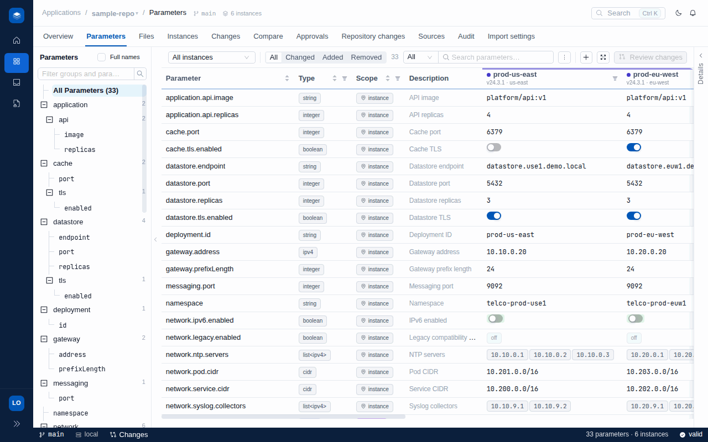
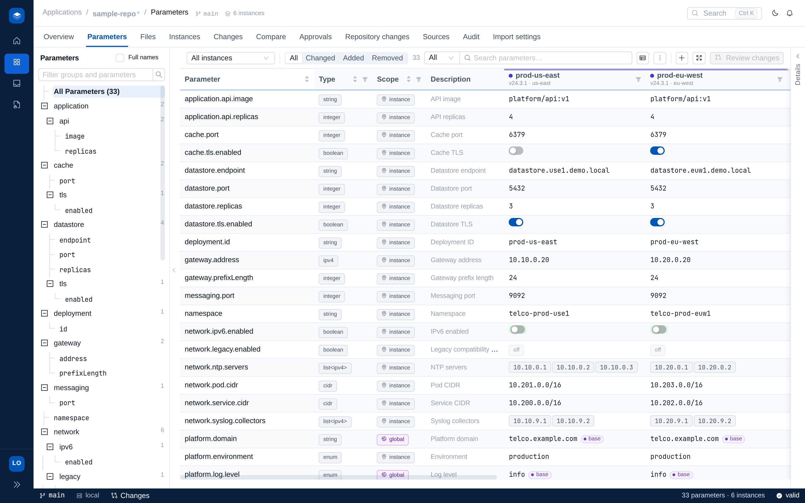
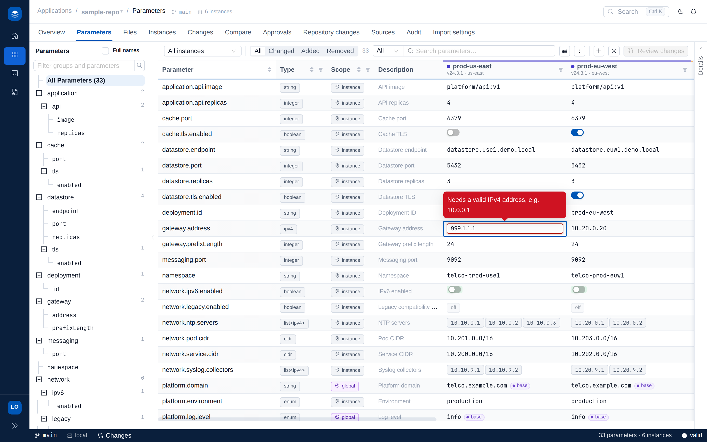
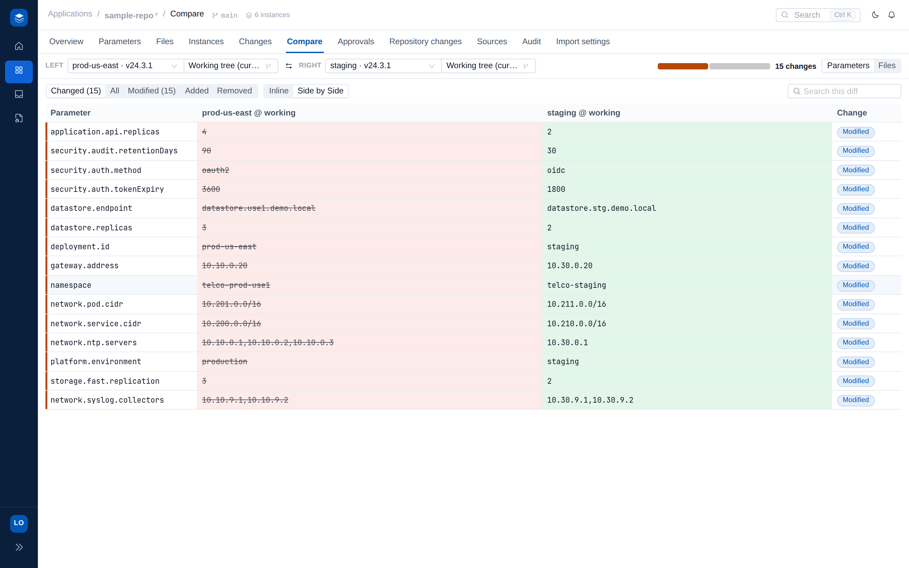

# Configer

**A spreadsheet for your GitOps config - where your Git files stay the source of truth.**

[](https://github.com/abhijeet-oxide/configer/actions/workflows/ci.yml)


Configer points at an existing repository, reads how it is already organized, and
shows your configuration as a grid: every **row is a parameter**, every **column
is an instance** (an environment, region, cluster, or site). You edit cells;
Configer edits your real files and opens a normal pull request.



## Why

A real fleet keeps its configuration in dozens of YAML/JSON/XML files spread
across environments, regions, and sites - Helm values, Kustomize overlays, kpt
packages, plain per-cluster folders. That leaves two bad options:

- **Hand-edit the files.** The same setting lives in ten places, so one change
  is ten careful edits, with nothing checking that a port is a port or that a
  memory limit is not below its request.
- **Build a config portal.** Now you have a second source of truth that drifts
  from Git and a database nobody trusts.

Configer removes the choice: it is the portal *without* the second source of
truth. The grid is a **view over your Git files**, and every edit is an
ordinary commit.

## What

One screen for the whole fleet - parameters down, instances across, typed and
validated values in between:



- **Your files are the truth.** Nothing is generated or copied. Editing a cell
  makes a *surgical* edit to the real file - comments, key order, and blank
  lines preserved byte-for-byte - so the diff is exactly what a careful engineer
  would have written by hand.
- **The same setting is one row.** A `namespace` repeated across ten files
  becomes ONE row bound to ten locations; editing it fans out to all of them.
- **Every action is Git.** Edits collect into a draft; submitting cuts a branch
  and commit and opens a GitHub PR; approving merges. If Configer is down,
  nothing is blocked, and commits made directly in Git flow back into the grid.
- **Its footprint is metadata only** - one `.configer/` folder describing where
  each parameter lives, its type, and its rules. Never any values.

## How

**1. Onboard.** Point Configer at a repo and it detects the layout (Helm,
Kustomize, kpt, or plain folders), derives the instances from the folders,
extracts every tunable parameter, deduplicates settings repeated across files,
and skips the structural noise. Accepting the proposal is one reviewable commit.

**2. Edit, safely.** Values are typed and validated as you go - from JSON Schema
files next to your config, a preset library (ipv4, cidr, port, semver, ...), and
the values themselves. Kubernetes quantities are first-class: `cpu`/`memory`
validate their format and positivity, and a resource limit is checked to be at
least its request. Bad values never reach Git.

<p align="center">
  
  
</p>

**3. Review and publish.** Edits stage into a draft you can review file-by-file,
submit as a branch + commit + GitHub PR, and merge - the ordinary review flow
your team already uses.

See **[FEATURES.md](FEATURES.md)** for the full tour with screenshots.

## Quick start

```bash
make install   # first time: go modules + npm
make dev       # backend :8080 + frontend :5173 (Ctrl-C stops both)
```

Open http://localhost:5173. The bundled `sample-repo/` (a telco fleet with six
instances, shared config, XML vendor files, a deduplicated namespace, and
validated CPU/memory limits) is served out of the box.

Point it at other shapes - `sample-repos/` holds realistic Helm, Kustomize, kpt,
raw multi-cluster Kubernetes, and telco-RAN repositories:

```bash
make backend CONFIGER_REPO=./sample-repos/helm-umbrella   # try any of them
make functional-test                                       # onboard + verify all of them
```

## Learn more

| Doc | What's in it |
|-----|--------------|
| [FEATURES.md](FEATURES.md) | The full feature tour, with screenshots. |
| [CONFIG.md](CONFIG.md) / [.env.example](.env.example) | Every configuration option. |
| [DEVELOPMENT.md](DEVELOPMENT.md) | Local dev workflow, testing, and conventions. |
| [CLAUDE.md](CLAUDE.md) | Architecture and the `.configer` schema. |
| [sample-repos/](sample-repos/) | The corpus of realistic repos the scanner is tested against. |
| `http://localhost:8080/api/docs` | Interactive API reference (spec generated from the code). |

## Project layout

| Path | Description |
|------|-------------|
| `backend/` | Go API: layout detection, discovery/dedup, the `pathedit` engine (surgical YAML/JSON/XML edits), resolver, grid, change requests, git, optional platform. |
| `frontend/` | React + TypeScript + Ant Design SPA: grid, file mode, onboarding, instances, compare, approvals. |
| `sample-repo/` | The demo fixture served out of the box. |
| `sample-repos/` | Realistic Helm / Kustomize / kpt / K8s / telco repos for scanner testing. |
| `docs/` | Screenshots, the demo GIF, and design notes. |
| `deploy/` | docker-compose stack (backend + frontend + Postgres). |
